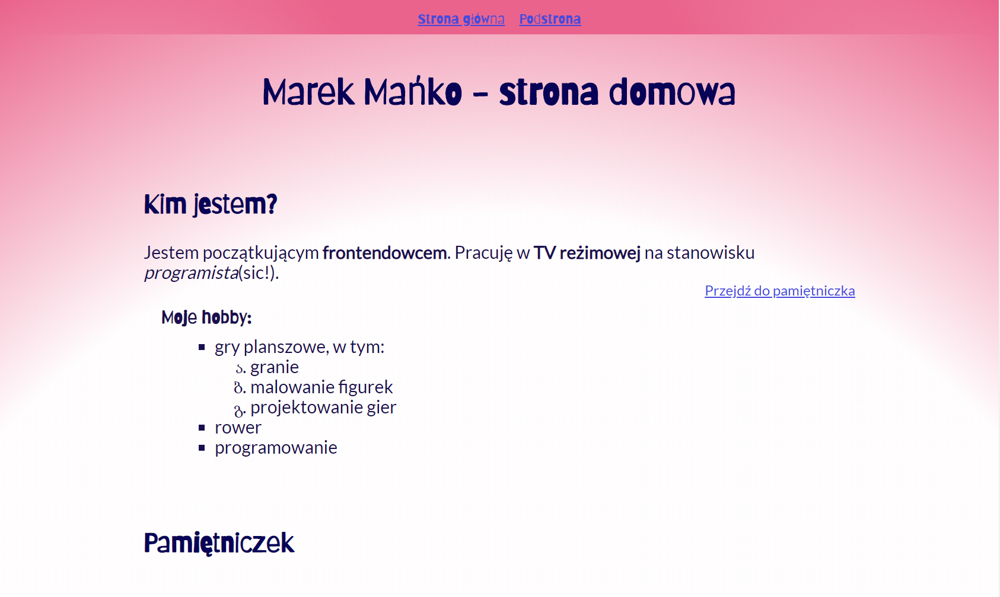

# Strona domowa
## Strona powastałą w ramach kursu WTF:Co ten frontend?

-----------------------------------------------------------------------------------------
### Na przykładzie tworzenia strony ćwiczone były:

1. **HTML**
    1. BEM
    2. Formularze
2. **CSS**
    1. Flexbox
    2. Grid
    3. Media queries
    4. SASS
3. **JS**
    1. Eventy
    2. Obiekty
    3. Node.js
    4. NPM

### Storona powstała przy użyciu narzędzi:

1. [Visual Studio Code](https://code.visualstudio.com/)
2. [Git](https://git-scm.com/), [moje konto na github](https://github.com/mankom)
3. [GULP](https://gulpjs.com/)
4. [Trello](https://trello.com/) (*Kanban*)
5. [CSS Gradient](https://cssgradient.io/)
6. [Google fonts](https://fonts.google.com/)
7. [Figma](https://www.figma.com/)

[***Kliknij by przejść do tej strony***](https://mankom.github.io/homepage-gulp/)

